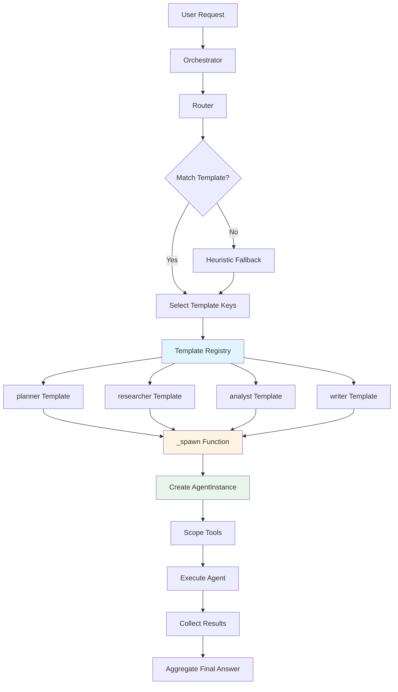
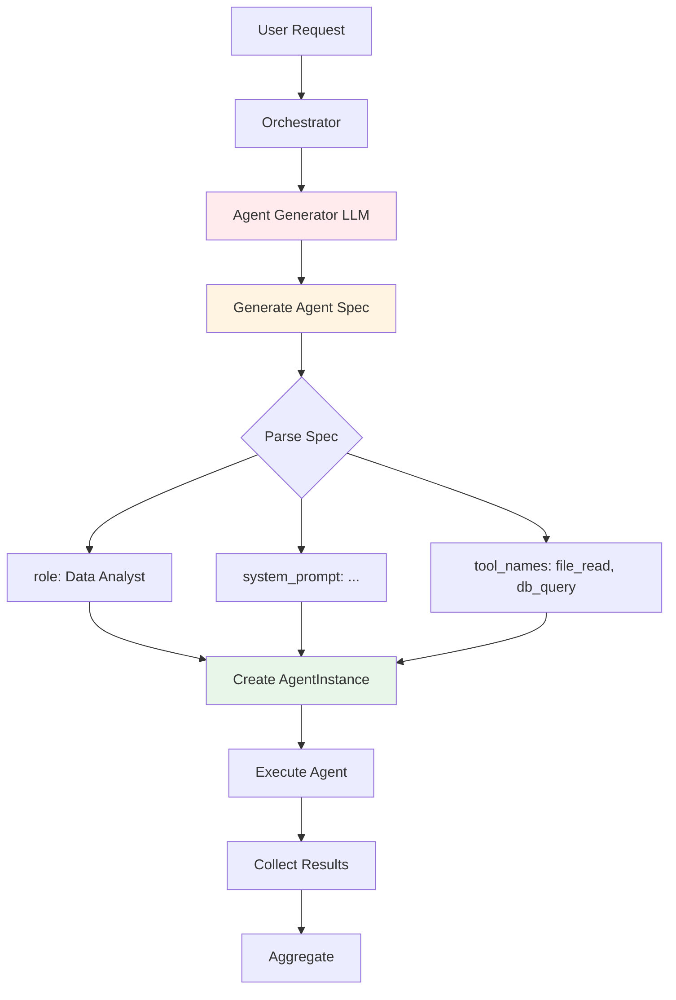
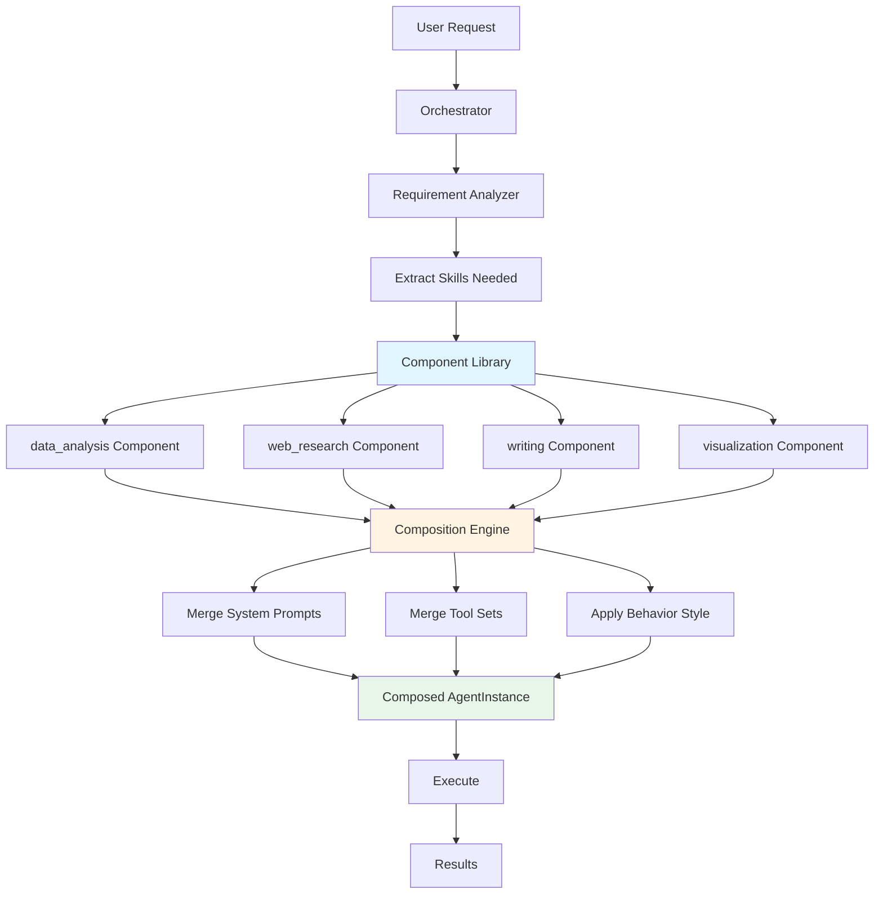
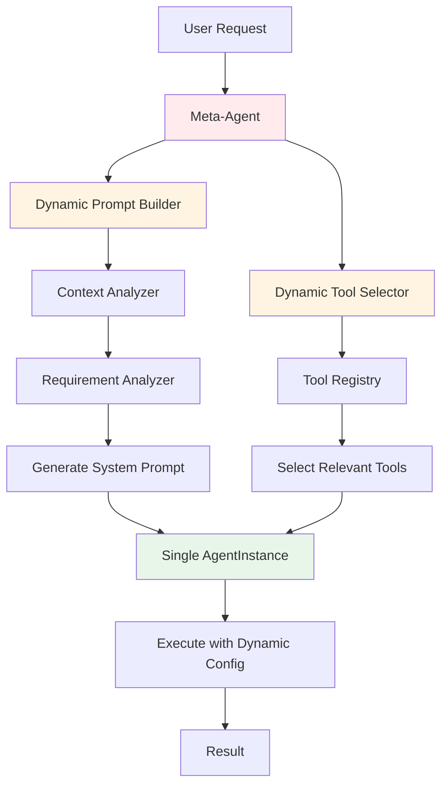
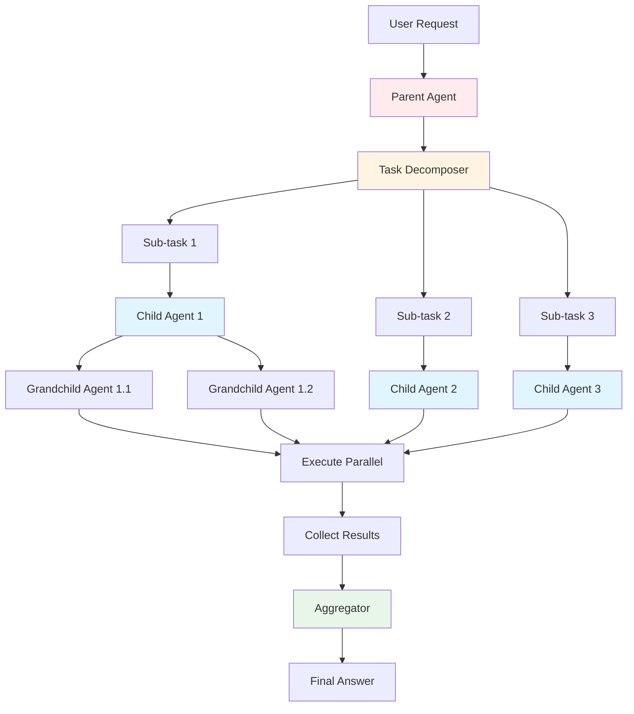
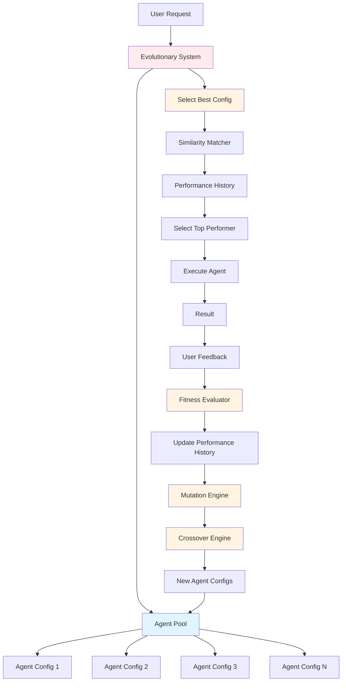
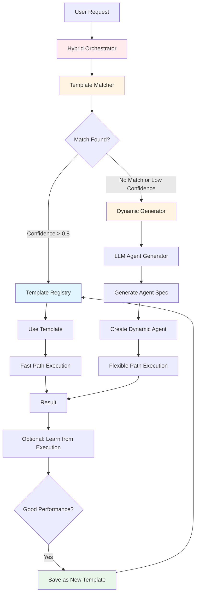
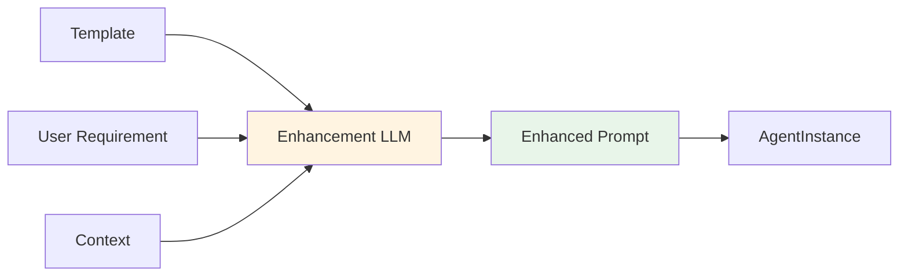
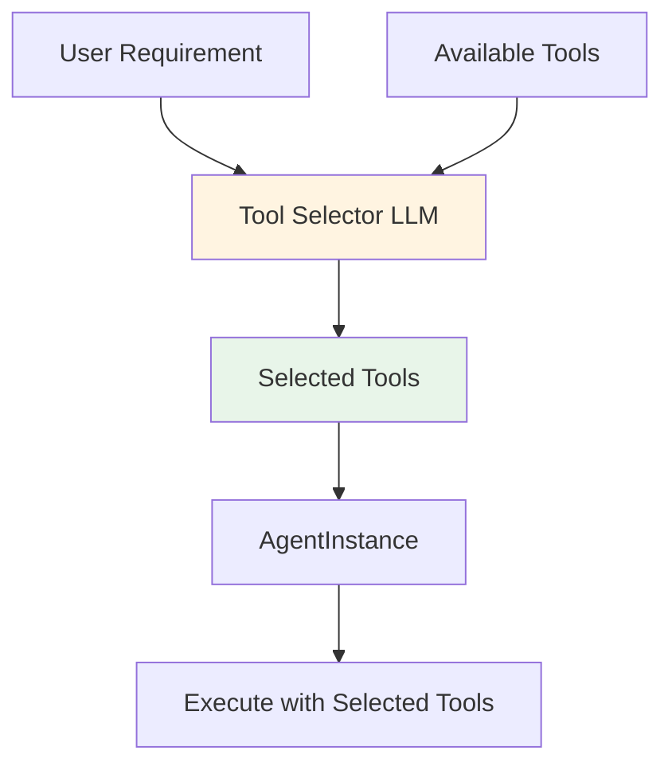
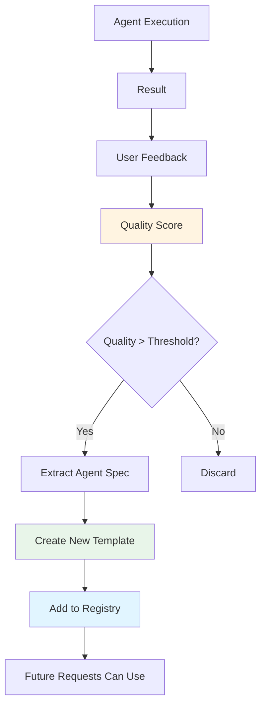

# Alternative Approaches for Dynamic Agent Systems

## Current Approach: Template-Based Selection

**What it is:**
- Predefined agent templates (roles) in a registry
- Dynamic selection of which templates to use
- Runtime instantiation from selected templates

**Dynamic aspects:**
- ✅ Which agents to spawn (routing)
- ✅ Tool scoping per agent
- ✅ Execution order
- ❌ Agent roles/types (static)
- ❌ System prompts (static per template)

### Architecture Diagram



---

## Alternative Approach 1: LLM-Generated Agent Creation

### Concept
Use an LLM to generate agent specifications (system prompt, tool selection) on-the-fly based on the user's request.

### Implementation

```python
class DynamicAgentGenerator:
    async def generate_agent_spec(self, requirement: str, available_tools: List[Tool]) -> AgentSpec:
        prompt = f"""
        Based on this user requirement: "{requirement}"
        
        Create an agent specification:
        1. What should this agent's role be?
        2. What system prompt should guide its behavior?
        3. Which tools from {available_tools} should it have access to?
        
        Return JSON:
        {{
            "role": "...",
            "system_prompt": "...",
            "tool_names": ["tool1", "tool2"]
        }}
        """
        
        response = await self.llm.chat([Message("user", prompt)])
        spec = json.loads(response)
        return AgentSpec(**spec)

# Usage
generator = DynamicAgentGenerator()
spec = await generator.generate_agent_spec(user_request, all_tools)
agent = AgentInstance.from_spec(spec, llm, tools)
```

### Architecture Diagram



### Advantages
- ✅ Truly dynamic: Creates agents for any task
- ✅ Adaptive: Tailors agents to specific requests
- ✅ No predefined roles needed
- ✅ Can create specialized agents per use case

### Disadvantages
- ❌ Higher LLM costs (generation overhead)
- ❌ Less predictable behavior
- ❌ Harder to debug (agents vary each time)
- ❌ Security concerns (uncontrolled agent creation)
- ❌ Quality varies (depends on LLM generation)
- ❌ Slower (extra LLM call per agent)

### Use Cases
- Research/exploration scenarios
- One-off specialized tasks
- When flexibility > predictability

---

## Alternative Approach 2: Compositional Agent Building

### Concept
Build agents by composing smaller, reusable components (skills, behaviors, tool sets).

### Implementation

```python
class AgentComponent:
    """Reusable agent building blocks"""
    skill: str  # e.g., "data_analysis", "web_research"
    behavior: str  # e.g., "thorough", "quick", "creative"
    tool_set: List[str]

class CompositionalAgentBuilder:
    def build_agent(self, requirement: str) -> AgentInstance:
        # Analyze requirement to determine needed components
        needed_skills = self._extract_skills(requirement)
        # ["data_analysis", "web_research"]
        
        behavior = self._determine_behavior(requirement)
        # "thorough"
        
        # Compose agent from components
        components = [
            self.skill_library["data_analysis"],
            self.skill_library["web_research"]
        ]
        
        system_prompt = self._compose_prompt(components, behavior)
        tools = self._merge_tools(components)
        
        return AgentInstance(
            system_prompt=system_prompt,
            tools=tools
        )
```

### Architecture Diagram



### Advantages
- ✅ More flexible than templates
- ✅ Reusable components
- ✅ Predictable (components are tested)
- ✅ Can create many agent variations
- ✅ Better than pure LLM generation

### Disadvantages
- ❌ Still requires component library
- ❌ Composition logic can be complex
- ❌ May create suboptimal combinations

### Use Cases
- When you have well-defined skill sets
- Multi-domain applications
- When you want flexibility with some control

---

## Alternative Approach 3: Meta-Agent with Dynamic Prompting

### Concept
Single meta-agent that dynamically adapts its behavior and tool usage based on context, without creating separate agent instances.

### Implementation

```python
class MetaAgent:
    async def execute(self, requirement: str, context: Dict) -> str:
        # Dynamically build system prompt based on requirement
        dynamic_prompt = await self._build_dynamic_prompt(requirement, context)
        
        # Dynamically select tools based on requirement
        selected_tools = await self._select_tools(requirement, context)
        
        # Single agent execution with dynamic configuration
        return await self._execute_with_config(dynamic_prompt, selected_tools, requirement)
    
    async def _build_dynamic_prompt(self, requirement: str, context: Dict) -> str:
        # Use LLM to generate context-aware prompt
        prompt_builder = f"""
        User wants: {requirement}
        Available resources: {context['files']}, {context['databases']}
        
        Generate a system prompt that will guide an agent to complete this task.
        """
        return await self.llm.chat([Message("user", prompt_builder)])
```

### Architecture Diagram



### Advantages
- ✅ No agent creation overhead
- ✅ Fully adaptive to each request
- ✅ Simpler architecture (one agent)
- ✅ Lower latency

### Disadvantages
- ❌ Less specialized (jack-of-all-trades)
- ❌ Harder to parallelize
- ❌ Context window limits
- ❌ Less clear separation of concerns

### Use Cases
- Simple, single-agent scenarios
- When latency is critical
- When tasks don't need specialization

---

## Alternative Approach 4: Hierarchical Agent Networks

### Concept
Create a network of agents where parent agents can spawn child agents dynamically, creating a tree/graph structure.

### Implementation

```python
class HierarchicalAgent:
    async def execute(self, task: str) -> str:
        # Parent agent analyzes task
        sub_tasks = await self._decompose(task)
        
        # Spawn child agents for each sub-task
        child_agents = []
        for sub_task in sub_tasks:
            child_spec = await self._create_child_spec(sub_task)
            child_agent = await self._spawn_child(child_spec)
            child_agents.append(child_agent)
        
        # Execute children (parallel or sequential)
        results = await self._execute_children(child_agents)
        
        # Aggregate results
        return await self._aggregate(results)
```

### Architecture Diagram



### Advantages
- ✅ Handles complex, multi-step tasks
- ✅ Natural decomposition
- ✅ Can parallelize sub-tasks
- ✅ Scales to complex problems

### Disadvantages
- ❌ Complex orchestration
- ❌ Higher LLM costs (many agents)
- ❌ Harder to debug
- ❌ Risk of agent explosion

### Use Cases
- Complex multi-step workflows
- Research projects
- When tasks naturally decompose

---

## Alternative Approach 5: Evolutionary Agent System

### Concept
Agents evolve and adapt over time based on performance feedback, learning which configurations work best.

### Implementation

```python
class EvolutionaryAgentSystem:
    def __init__(self):
        self.agent_pool = []  # Population of agent configurations
        self.performance_history = {}  # Track what works
    
    async def execute(self, requirement: str) -> str:
        # Select best agent config based on similar past requirements
        best_config = self._select_best_config(requirement)
        
        # Execute with selected config
        result = await self._execute_with_config(best_config, requirement)
        
        # Collect feedback (user rating, task completion, etc.)
        feedback = await self._collect_feedback(result)
        
        # Evolve agent pool based on feedback
        self._evolve_pool(feedback)
        
        return result
```

### Architecture Diagram



### Advantages
- ✅ Self-improving over time
- ✅ Learns from experience
- ✅ Adapts to user patterns
- ✅ Optimizes for specific use cases

### Disadvantages
- ❌ Requires feedback mechanism
- ❌ Needs time to learn
- ❌ Complex implementation
- ❌ May overfit to specific patterns

### Use Cases
- Long-running systems
- When you have user feedback
- Personalized agent systems

---

## Comparison Matrix

| Approach | Dynamic Creation | Predictability | Cost | Complexity | Best For |
|----------|-----------------|----------------|------|-------------|----------|
| **Template-Based (Current)** | ⭐⭐ | ⭐⭐⭐⭐⭐ | ⭐⭐⭐⭐⭐ | ⭐⭐ | Production, safety-critical |
| **LLM-Generated** | ⭐⭐⭐⭐⭐ | ⭐⭐ | ⭐⭐ | ⭐⭐⭐ | Research, exploration |
| **Compositional** | ⭐⭐⭐⭐ | ⭐⭐⭐⭐ | ⭐⭐⭐⭐ | ⭐⭐⭐ | Flexible but controlled |
| **Meta-Agent** | ⭐⭐⭐⭐ | ⭐⭐⭐ | ⭐⭐⭐⭐ | ⭐⭐ | Simple, fast scenarios |
| **Hierarchical** | ⭐⭐⭐⭐ | ⭐⭐⭐ | ⭐⭐ | ⭐⭐⭐⭐⭐ | Complex workflows |
| **Evolutionary** | ⭐⭐⭐ | ⭐⭐⭐ | ⭐⭐⭐ | ⭐⭐⭐⭐⭐ | Long-term learning |

---

## Hybrid Approach: Best of Both Worlds

Combine template-based with dynamic generation:

```python
class HybridOrchestrator:
    async def execute(self, requirement: str) -> str:
        # First, try to match to existing templates
        matched_template = self._match_to_template(requirement)
        
        if matched_template and matched_template.confidence > 0.8:
            # Use template (fast, predictable)
            return await self._execute_template(matched_template, requirement)
        else:
            # Generate dynamic agent (flexible, adaptive)
            dynamic_agent = await self._generate_agent(requirement)
            return await self._execute_dynamic(dynamic_agent, requirement)
```

### Architecture Diagram



### Benefits
- Fast path for common tasks (templates)
- Flexible path for novel tasks (dynamic)
- Best of both worlds
- Can learn and create new templates over time

---

## Recommendations

### For Production Systems
**Use Template-Based (Current Approach)** when:
- Predictability and safety are critical
- You have well-defined use cases
- Cost optimization matters
- You need auditability

### For Research/Exploration
**Use LLM-Generated** when:
- Exploring new domains
- Tasks vary significantly
- Flexibility > predictability
- Cost is less concern

### For Complex Workflows
**Use Hierarchical** when:
- Tasks naturally decompose
- Parallelization is beneficial
- You have complex multi-step processes

### For Adaptive Systems
**Use Hybrid** when:
- You want both speed and flexibility
- Common patterns exist but novel cases arise
- You can invest in both systems

---

## Implementation Path: Making Current System More Dynamic

### Step 1: Add Dynamic Prompt Enhancement

**Architecture:**



**Implementation:**
```python
# Enhance templates with dynamic context
async def enhance_template(template: AgentTemplate, requirement: str, context: Dict) -> str:
    enhancement_prompt = f"""
    Template: {template.system_prompt}
    User requirement: {requirement}
    Context: {context}
    
    Enhance the template prompt to better handle this specific request.
    """
    enhanced = await llm.chat([Message("user", enhancement_prompt)])
    return enhanced
```

### Step 2: Dynamic Tool Selection

**Architecture:**



**Implementation:**
```python
# Select tools dynamically based on requirement
async def select_tools(requirement: str, available_tools: List[Tool]) -> List[str]:
    selection_prompt = f"""
    Requirement: {requirement}
    Available tools: {[t.name for t in available_tools]}
    
    Which tools are needed? Return comma-separated list.
    """
    selected = await llm.chat([Message("user", selection_prompt)])
    return parse_tool_list(selected)
```

### Step 3: Template Learning

**Architecture:**



**Implementation:**
```python
# Learn new templates from successful executions
class TemplateLearner:
    def learn_from_execution(self, requirement: str, agent_spec: Dict, result_quality: float):
        if result_quality > threshold:
            # Create new template from successful agent
            new_template = AgentTemplate.from_spec(agent_spec)
            self.registry.add(new_template)
```

---

## Conclusion

The current template-based approach is a **pragmatic middle ground**:
- More dynamic than static single-agent systems
- More controlled than fully LLM-generated systems
- Production-ready with good performance

For truly dynamic systems, consider:
1. **Hybrid approach**: Templates + dynamic generation
2. **Gradual enhancement**: Add dynamic features incrementally
3. **Domain-specific**: Choose approach based on use case

The best system depends on your specific requirements:
- **Safety-critical**: Template-based
- **Exploratory**: LLM-generated
- **Complex workflows**: Hierarchical
- **Adaptive**: Hybrid or Evolutionary
