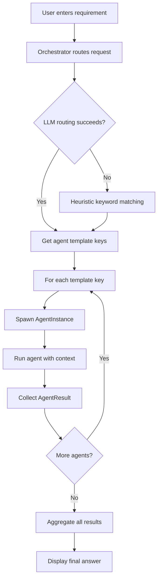
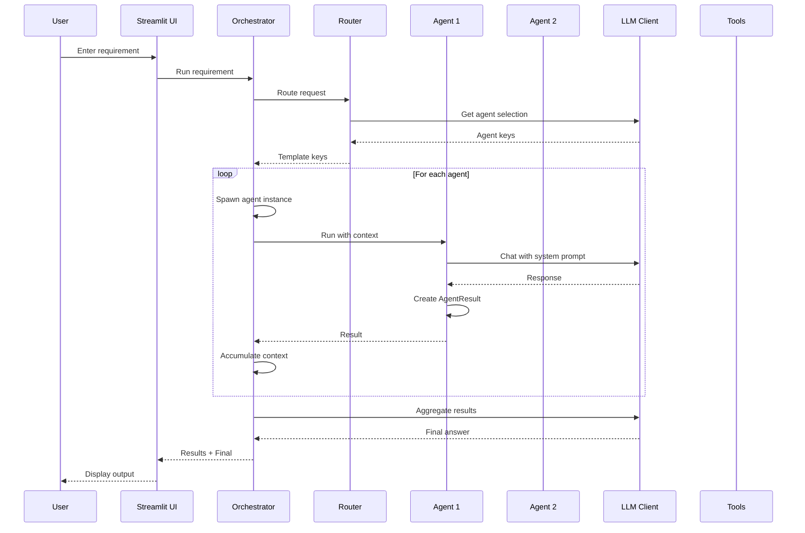

# Understanding the Runtime Agent System

## Overview

The Runtime Agent Spawner is a system that dynamically creates and orchestrates AI agents to handle user requests. Instead of using a single static agent, the system selects appropriate agent templates based on the request, spawns instances, and aggregates their results into a final answer.

## System Architecture

### Core Components

#### 1. Orchestrator (`runtime_agents/orchestrator.py`)

The `Orchestrator` is the central coordinator that manages the agent lifecycle:

- **Routing**: Determines which agent templates should handle a request
  - Uses LLM-based routing with a prompt asking which agents to run
  - Falls back to heuristic keyword matching if LLM routing fails
  - Returns a list of agent template keys to execute

- **Spawning**: Creates agent instances from templates
  - Takes a template key and creates an `AgentInstance`
  - Scopes tools to only those allowed by the template
  - Each instance gets its own LLM client and tool set

- **Execution**: Runs agents sequentially
  - Executes agents in the order determined by routing
  - Passes context from previous agents to subsequent ones
  - Collects results from each agent

- **Aggregation**: Combines agent outputs into a final answer
  - Uses an LLM to synthesize all agent results
  - Produces a coherent final response

**Key Methods:**
- `_route(requirement: str) -> List[str]`: Determines which agents to run
- `_spawn(key: str) -> AgentInstance`: Creates an agent instance from a template
- `run(requirement: str) -> Tuple[List[AgentResult], str]`: Main execution method

#### 2. AgentTemplate (`runtime_agents/agents.py`)

`AgentTemplate` defines a reusable agent specification:

- **Immutable specification**: Defined once, used many times
- **Components**:
  - `key`: Unique identifier (e.g., "planner", "researcher")
  - `name`: Human-readable name
  - `system_prompt`: Role-specific instructions for the agent
  - `tool_names`: List of tools this agent can use

**Design Philosophy**: Templates are version-controlled, pre-approved agent roles. In production, these would be managed in source control and versioned.

#### 3. AgentInstance (`runtime_agents/agents.py`)

`AgentInstance` is a runtime-spawned agent created from a template:

- **Runtime entity**: Created per request (or per session in future versions)
- **Scoped tools**: Only has access to tools specified in its template
- **Execution**: Runs with a user input and optional context from other agents

**Key Methods:**
- `run(user_input: str, *, context: Optional[str] = None) -> AgentResult`: Executes the agent

**Current Limitation**: The agent describes available tools but doesn't actually execute them. Tool calls are not parsed or executed automatically.

#### 4. LLMClient (`runtime_agents/llm.py`)

Abstract interface for LLM communication:

- **Abstract base class**: Defines the `chat()` method interface
- **Message-based**: Uses a list of `Message` objects with roles (system, user, assistant, tool)
- **Configurable**: Supports temperature and max_tokens parameters

#### 5. OpenAIChatClient (`runtime_agents/llm.py`)

Concrete implementation using OpenAI's Chat Completions API:

- **HTTP-based**: Uses `httpx` for async HTTP requests
- **OpenAI-compatible**: Works with OpenAI API or compatible gateways (LiteLLM, vLLM)
- **Configurable base URL**: Can point to different endpoints
- **Error handling**: Provides helpful error messages for common issues (401, 429, etc.)

**Configuration**:
- API key loaded from `.env` file (`OPENAI_API_KEY`)
- Model and base URL configurable via environment variables or UI

#### 6. Tools (`runtime_agents/tools.py`)

Tools are capabilities agents can use:

- **Protocol-based**: Uses Python's `Protocol` for type safety
- **Interface**: Tools have `name`, `description`, and a `__call__` method
- **Current Tools**:
  - `TimeTool`: Returns current UTC time
  - `HttpGetTool`: Fetches content from URLs via HTTP GET
  - `MCPToolAdapter`: Placeholder for Model Context Protocol integration

**Tool Execution**: Currently, tools are described to agents but not automatically executed. Agents mention tools in their responses, but the system doesn't parse and execute tool calls.

#### 7. Streamlit UI (`app.py`)

The user interface built with Streamlit:

- **Single-request model**: User enters a requirement, clicks "Run", gets results
- **Sidebar configuration**: API key override, model selection, base URL
- **Agent registry**: Fixed set of agent templates (planner, researcher, analyst, writer)
- **Results display**: Shows spawned agents and their outputs, plus final aggregated answer

## Current Workflow

1. **User Input**: User enters a requirement in the text area
2. **Routing**: Orchestrator determines which agents to run (planner, researcher, analyst, writer, etc.)
3. **Spawning**: For each selected template, an AgentInstance is created with scoped tools
4. **Sequential Execution**: Agents run one after another, each receiving context from previous agents
5. **Result Collection**: Each agent produces an `AgentResult` with its output
6. **Aggregation**: An LLM synthesizes all agent outputs into a final answer
7. **Display**: UI shows both individual agent outputs and the final aggregated result

## Current Capabilities

### Dynamic Agent Selection
- The system intelligently selects which agents to use based on the request
- Uses LLM reasoning with fallback heuristics
- Only spawns agents that are needed for the task

### Context Passing
- Agents receive context from previous agents in the chain
- Context is accumulated and passed forward
- Enables agents to build on each other's work

### Tool Scoping
- Each agent template defines which tools it can use
- Agents only see tools they're allowed to use
- Prevents agents from accessing inappropriate capabilities

### Result Aggregation
- Multiple agent outputs are synthesized into a coherent final answer
- Uses LLM to combine and refine results
- Produces a single, comprehensive response

### Basic Tools
- Time tool for temporal information
- HTTP GET tool for fetching web content
- Extensible tool system for adding new capabilities

## Current Limitations

### Single Request-Response Model
- No conversation history
- Each request is independent
- No multi-turn dialogue support

### No File Upload
- Cannot process uploaded files
- No file analysis capabilities
- No document processing

### No Database Connection
- Cannot connect to databases
- No schema introspection
- No data querying capabilities

### No Session Persistence
- No session management
- No state persistence between requests
- No chat history storage

### No Tool Execution
- Tools are described but not executed
- Agents mention tools but don't actually call them
- No automatic tool call parsing

### Fixed Agent Registry
- Agent templates are hardcoded in `app.py`
- Cannot dynamically add or modify agents
- No agent versioning or management

### No Image Processing
- Cannot process images or photos
- No vision model integration
- No image analysis capabilities

## Data Flow

## Agent Template Registry

The system currently includes four agent templates:

1. **Planner** (`planner`)
   - Role: Breaks down requests into execution plans
   - Tools: `time_now`
   - Use case: Initial planning and task decomposition

2. **Researcher** (`researcher`)
   - Role: Gathers references and factual details
   - Tools: `http_get`
   - Use case: Information gathering and fact-checking

3. **Analyst** (`analyst`)
   - Role: Analyzes tradeoffs and produces structured reasoning
   - Tools: None
   - Use case: Comparative analysis and decision-making

4. **Writer** (`writer`)
   - Role: Writes clean, concise outputs
   - Tools: None
   - Use case: Content generation and formatting

## Technical Stack

- **UI Framework**: Streamlit
- **LLM**: OpenAI API (via HTTP)
- **HTTP Client**: httpx (async)
- **Package Manager**: uv
- **Language**: Python 3.11+
- **Architecture**: Async/await pattern with anyio

## Configuration

The system is configured via:

- **Environment Variables** (loaded from `.env` file):
  - `OPENAI_API_KEY`: OpenAI API key (required)
  - `OPENAI_MODEL`: Model to use (default: "gpt-4o-mini")
  - `OPENAI_BASE_URL`: API endpoint (default: "https://api.openai.com")

- **UI Overrides**: Users can override model and base URL in the Streamlit sidebar

## Future Extensibility

The system is designed with extensibility in mind:

- **MCP Integration**: Placeholder for Model Context Protocol tools
- **Custom Tools**: Easy to add new tools implementing the `Tool` protocol
- **Agent Templates**: Can add new templates to the registry
- **LLM Providers**: Can implement new `LLMClient` subclasses for other providers
