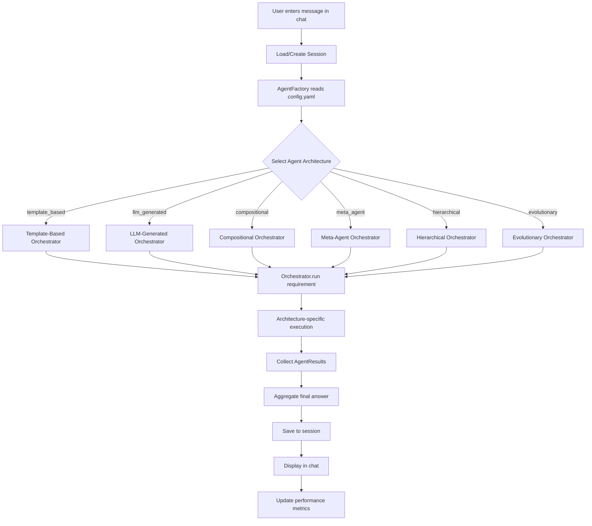
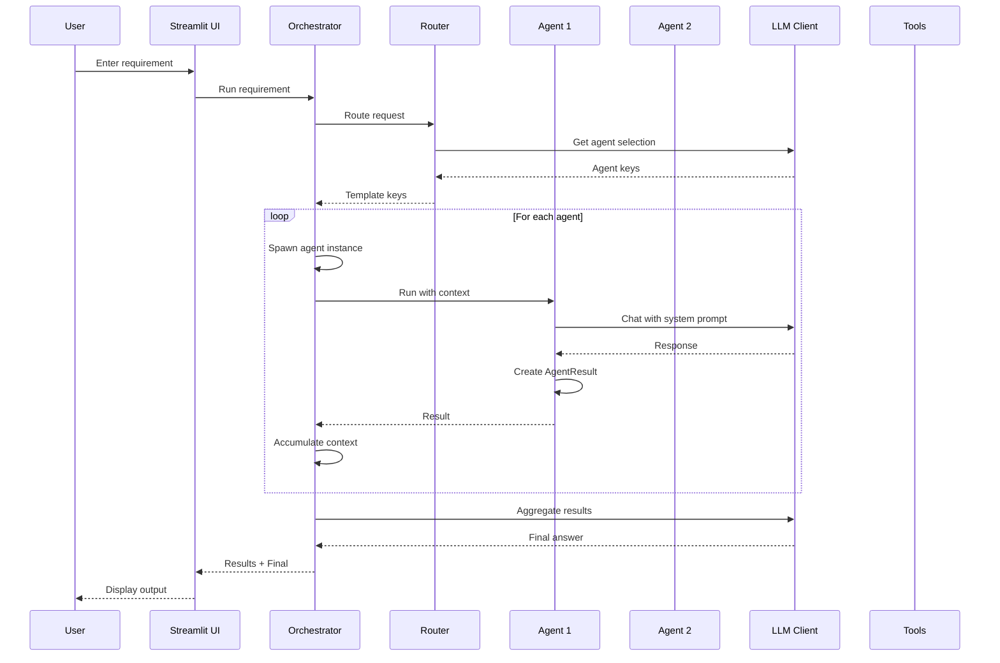
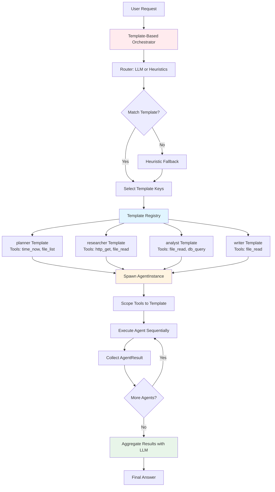
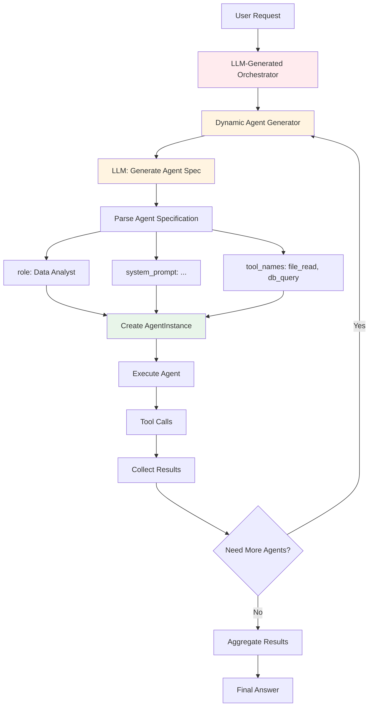
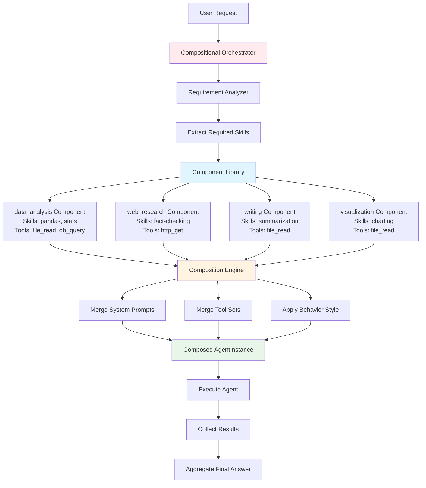
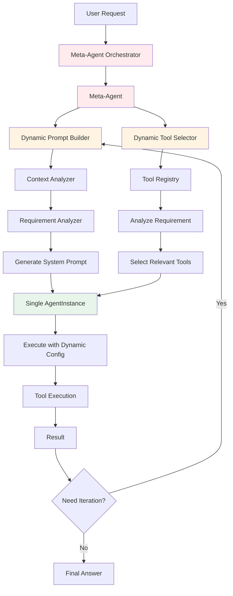
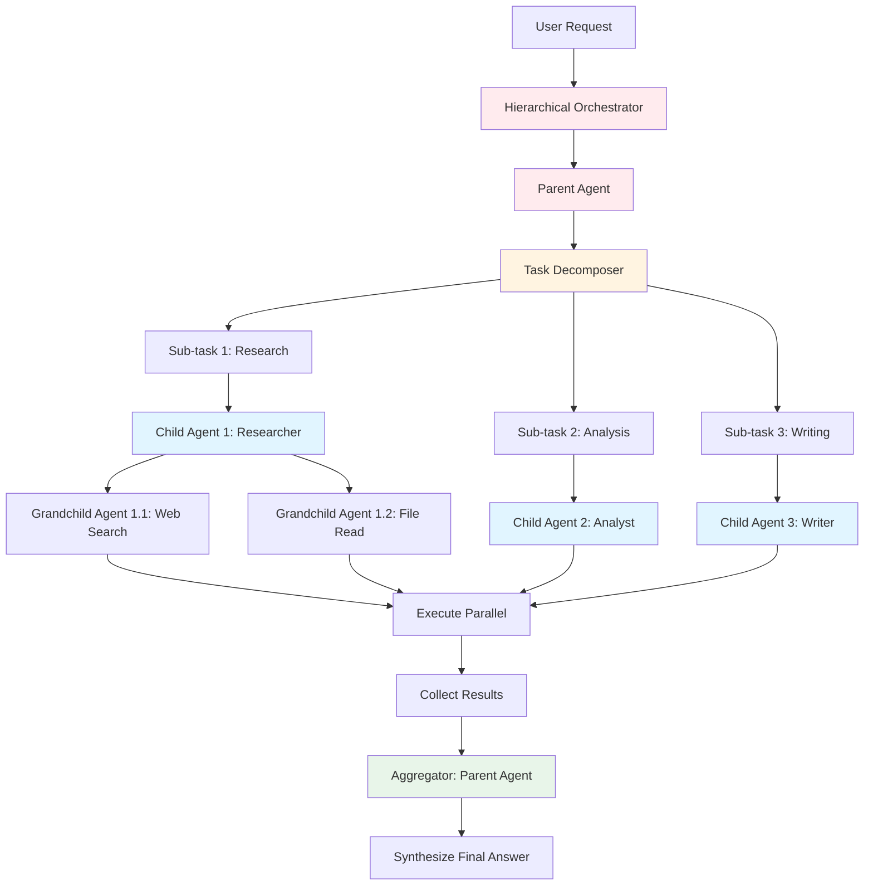
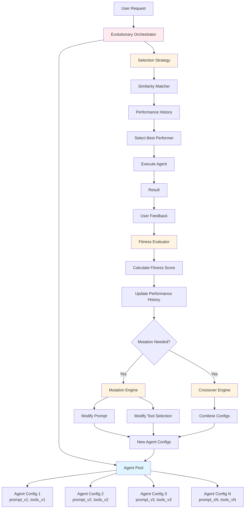

# Understanding the Runtime Agent System

## Overview

The Runtime Agent Spawner is a **multi-architecture agent system** that supports six different agent orchestration approaches. The system dynamically creates and orchestrates AI agents to handle user requests through conversational chat, file/image uploads, and database connections. Instead of using a single static agent, the system can select from multiple agent architectures, each with different strengths and use cases.

## System Architecture

### Multi-Architecture Support

The system supports **six agent architectures** that can be selected via configuration:

1. **Template-Based** (`runtime_agents/template_based/`): Predefined agent templates with fixed roles (planner, researcher, analyst, writer)
2. **LLM-Generated** (`runtime_agents_llm_generated/`): Dynamically creates agent specifications using an LLM
3. **Compositional** (`runtime_agents_compositional/`): Builds agents from reusable components (skills, behaviors, tool sets)
4. **Meta-Agent** (`runtime_agents_meta/`): Single adaptive agent that dynamically adjusts its prompt and tool selection
5. **Hierarchical** (`runtime_agents_hierarchical/`): Tree-structured agents for complex task decomposition
6. **Evolutionary** (`runtime_agents_evolutionary/`): Agents that learn and adapt over time through feedback loops

### Core Components

#### 1. Agent Factory (`utils/agent_factory.py`)

The `AgentFactory` is responsible for creating orchestrators based on configuration:

- **Configuration Management**: Reads `config.yaml` to determine active agent type
- **Dynamic Instantiation**: Creates the appropriate orchestrator class based on configuration
- **Architecture Selection**: Supports runtime switching between agent architectures via UI
- **Dependency Injection**: Passes common dependencies (LLM, tools, session context) to orchestrators

**Key Methods:**
- `get_available_agent_types() -> Dict[str, Any]`: Returns all available agent types
- `get_active_agent_type() -> str`: Returns currently active agent type from config
- `set_active_agent_type(agent_type: str)`: Updates config and saves it
- `create_orchestrator(...) -> BaseOrchestrator`: Creates orchestrator instance

#### 2. Base Orchestrator (`runtime_agents/shared/base.py`)

All orchestrators implement the `BaseOrchestrator` protocol:

- **Common Interface**: Defines `run(requirement: str) -> Tuple[List[AgentResult], str]` method
- **Shared Types**: `AgentResult` and `ExecutionMetrics` dataclasses
- **Protocol-based**: Uses Python's `Protocol` for type safety without inheritance

#### 3. Template-Based Orchestrator (`runtime_agents/template_based/orchestrator.py`)

The original orchestrator implementation (now one of six options):

- **Routing**: Determines which agent templates should handle a request
  - Uses LLM-based routing with a prompt asking which agents to run
  - Falls back to heuristic keyword matching if LLM routing fails
  - Returns a list of agent template keys to execute

- **Spawning**: Creates agent instances from templates
  - Takes a template key and creates an `AgentInstance`
  - Scopes tools to only those allowed by the template
  - Each instance gets its own LLM client and tool set

- **Execution**: Runs agents sequentially
  - Executes agents in the order determined by routing
  - Passes context from previous agents to subsequent ones
  - Collects results from each agent

- **Aggregation**: Combines agent outputs into a final answer
  - Uses an LLM to synthesize all agent results
  - Produces a coherent final response

**Key Methods:**
- `_route(requirement: str) -> List[str]`: Determines which agents to run
- `_spawn(key: str) -> AgentInstance`: Creates an agent instance from a template
- `run(requirement: str) -> Tuple[List[AgentResult], str]`: Main execution method

#### 4. AgentTemplate (`runtime_agents/template_based/agents.py`)

`AgentTemplate` defines a reusable agent specification (used by template-based architecture):

- **Immutable specification**: Defined once, used many times
- **Components**:
  - `key`: Unique identifier (e.g., "planner", "researcher")
  - `name`: Human-readable name
  - `system_prompt`: Role-specific instructions for the agent
  - `tool_names`: List of tools this agent can use

**Design Philosophy**: Templates are version-controlled, pre-approved agent roles. In production, these would be managed in source control and versioned.

#### 5. AgentInstance (`runtime_agents/template_based/agents.py`)

`AgentInstance` is a runtime-spawned agent created from a template:

- **Runtime entity**: Created per request or per session
- **Scoped tools**: Only has access to tools specified in its template
- **Execution**: Runs with a user input and optional context from other agents
- **Automatic Tool Execution**: Detects file references and automatically executes `file_read` tool
- **Session Context**: Receives detailed context about uploaded files, images, and database connections

**Key Methods:**
- `run(user_input: str, *, context: Optional[str] = None) -> AgentResult`: Executes the agent

#### 6. Shared Components (`runtime_agents/shared/`)

Common utilities shared across all agent architectures:

- **`llm.py`**: `LLMClient` protocol and `OpenAIChatClient` implementation
- **`logger.py`**: Configurable logging with `get_logger()` function
- **`tools.py`**: `Tool` protocol and base tool definitions
- **`db_tools.py`**: Database connection, schema introspection, and query tools
- **`image_tools.py`**: Image analysis and listing tools
- **`base.py`**: `BaseOrchestrator` protocol, `AgentResult`, and `ExecutionMetrics`

#### 7. LLMClient (`runtime_agents/shared/llm.py`)

Abstract interface for LLM communication:

- **Protocol-based**: Uses Python's `Protocol` for type safety
- **Message-based**: Uses a list of `Message` objects with roles (system, user, assistant, tool)
- **Configurable**: Supports temperature and max_tokens parameters

#### 8. OpenAIChatClient (`runtime_agents/shared/llm.py`)

Concrete implementation using OpenAI's Chat Completions API:

- **HTTP-based**: Uses `httpx` for async HTTP requests
- **OpenAI-compatible**: Works with OpenAI API or compatible gateways (LiteLLM, vLLM)
- **Configurable base URL**: Can point to different endpoints
- **Error handling**: Provides helpful error messages for common issues (401, 429, etc.)

**Configuration**:
- API key loaded from `.env` file (`OPENAI_API_KEY`)
- Model and base URL configurable via environment variables or UI

#### 9. Tools (`runtime_agents/shared/tools.py`)

Tools are capabilities agents can use:

- **Protocol-based**: Uses Python's `Protocol` for type safety
- **Interface**: Tools have `name`, `description`, and a `__call__` method
- **Available Tools**:
  - `TimeTool`: Returns current UTC time
  - `HttpGetTool`: Fetches content from URLs via HTTP GET
  - `FileReadTool`: Reads content from uploaded files (text, PDF, CSV, JSON)
  - `FileListTool`: Lists files available in current session
  - `DatabaseConnectionTool`: Manages database connections
  - `SchemaIntrospectionTool`: Fetches table/schema metadata
  - `DatabaseQueryTool`: Executes queries with safety checks
  - `ImageAnalysisTool`: Analyzes images with vision models
  - `ImageListTool`: Lists images available in current session

**Tool Execution**: Tools are automatically executed when agents reference them. The system detects file references and automatically calls `file_read` when appropriate.

#### 10. Session Management (`utils/session_manager.py`)

Manages session persistence and state:

- **Session Data Structure**: Includes chat history, files, images, database connections, and agent state
- **Local File Storage**: Sessions stored as JSON files in `sessions/` directory
- **File Organization**: Uploaded files stored in `uploads/{session_id}/files/` and `uploads/{session_id}/images/`
- **CRUD Operations**: Create, load, save, delete, and list sessions
- **Portable**: No database required, all data stored in local files

#### 11. Tool Registry (`utils/tool_registry.py`)

Centralized tool creation and management:

- **Tool Factory**: `get_default_tools()` creates all available tools with proper dependencies
- **Session Integration**: Tools receive session context (files, images, DB connections)
- **Consistent Interface**: All orchestrators receive the same tool set

#### 12. Performance Tracker (`utils/performance_tracker.py`)

Tracks execution metrics for comparing agent architectures:

- **Metrics Collection**: Duration, success/failure, LLM calls, tool calls, agents spawned
- **JSON Storage**: Metrics saved to `performance_metrics.json`
- **Architecture Comparison**: Enables performance comparison across different agent types

#### 13. Streamlit UI (`app.py`)

The user interface built with Streamlit:

- **Conversational Chat**: ChatGPT-like interface with message history
- **Session Management**: Create, load, delete sessions via sidebar
- **File Upload**: Support for text, PDF, CSV, JSON files
- **Image Upload**: Support for PNG, JPG, JPEG, GIF, WebP
- **Database Connection**: Connect to PostgreSQL, MySQL, SQLite with schema introspection
- **Agent Architecture Selector**: Switch between different agent types via dropdown
- **Debug Logging**: Toggle debug logs and log level
- **Performance Metrics**: Display execution metrics for each run
- **Results Display**: Shows spawned agents and their outputs, plus final aggregated answer

## Current Workflow



### Detailed Workflow (Template-Based Example)

1. **User Input**: User enters a message in the chat interface
2. **Session Management**: System loads or creates a session, including chat history, files, images, and DB connections
3. **Context Building**: System builds detailed session context (available files, images, DB schemas, recent chat history)
4. **Agent Factory**: `AgentFactory` reads `config.yaml` to determine active agent architecture
5. **Orchestrator Creation**: Factory creates appropriate orchestrator with LLM client, tools, and session context
6. **Architecture-Specific Execution**: 
   - **Template-Based**: Routes request, spawns agent instances, runs sequentially
   - **LLM-Generated**: Generates agent specs dynamically, creates agents, executes
   - **Compositional**: Composes agents from components, executes
   - **Meta-Agent**: Adapts prompt and tools dynamically, executes
   - **Hierarchical**: Decomposes task into tree, executes parent-child agents
   - **Evolutionary**: Selects from agent pool, executes, evaluates, mutates
7. **Tool Execution**: Agents automatically execute tools when needed (file reads, DB queries, image analysis)
8. **Result Collection**: Each agent produces an `AgentResult` with its output
9. **Aggregation**: Orchestrator synthesizes all agent outputs into a final answer
10. **Session Update**: Chat history, agent results, and metrics saved to session file
11. **Display**: UI shows both individual agent outputs and the final aggregated result
12. **Performance Tracking**: Metrics collected and saved for comparison

## Current Capabilities

### Multi-Architecture Support
- **Six Agent Architectures**: Template-based, LLM-generated, compositional, meta-agent, hierarchical, and evolutionary
- **Runtime Selection**: Switch between architectures via UI or config file
- **Performance Comparison**: Track metrics for each architecture to compare effectiveness
- **Unified Interface**: All architectures implement `BaseOrchestrator` protocol

### Conversational Chat Interface
- **Multi-turn Dialogue**: Full conversation history maintained across messages
- **Chat-like UI**: Streamlit chat interface with message history
- **Context Preservation**: Agents receive full conversation context
- **Session Persistence**: Conversations saved to local files

### File Upload and Processing
- **Multiple File Types**: Text, PDF, CSV, JSON files supported
- **File Storage**: Files stored per session in `uploads/{session_id}/files/`
- **File Reading Tools**: Agents can read and analyze uploaded files
- **Automatic Detection**: System detects file references and automatically reads files when appropriate

### Image Upload and Analysis
- **Image Formats**: PNG, JPG, JPEG, GIF, WebP supported
- **Vision Integration**: Image analysis using vision-capable models
- **Image Storage**: Images stored per session in `uploads/{session_id}/images/`
- **Image Tools**: Agents can analyze and describe uploaded images

### Database Connection and Querying
- **Multiple Databases**: PostgreSQL, MySQL, SQLite support
- **Schema Introspection**: Agents can inspect database schemas and table structures
- **Query Execution**: Safe query execution with validation and row limits
- **Connection Management**: Multiple database connections per session
- **Table Selection**: Users can select specific tables to provide context

### Session Management
- **Local File Storage**: All session data stored in JSON files (portable, no database required)
- **Session CRUD**: Create, load, save, delete, and list sessions
- **State Persistence**: Chat history, files, images, DB connections persist across app restarts
- **Session Isolation**: Each session maintains its own state and resources

### Dynamic Agent Selection (Template-Based)
- The template-based architecture intelligently selects which agents to use based on the request
- Uses LLM reasoning with fallback heuristics
- Only spawns agents that are needed for the task

### Context Passing
- Agents receive detailed context about:
  - Uploaded files and their metadata
  - Uploaded images and their metadata
  - Database connections and selected tables
  - Recent conversation history
  - Previous agent outputs (in multi-agent architectures)
- Context is accumulated and passed forward
- Enables agents to build on each other's work

### Tool Scoping
- Each agent template defines which tools it can use
- Agents only see tools they're allowed to use
- Prevents agents from accessing inappropriate capabilities
- Tool registry centralizes tool creation and management

### Result Aggregation
- Multiple agent outputs are synthesized into a coherent final answer
- Uses LLM to combine and refine results
- Produces a single, comprehensive response

### Comprehensive Tool Set
- **Time Tool**: Temporal information
- **HTTP GET Tool**: Web content fetching
- **File Tools**: Read files, list available files
- **Database Tools**: Connect, introspect schemas, execute queries
- **Image Tools**: Analyze images, list available images
- **Extensible System**: Easy to add new tools via `Tool` protocol

### Debug Logging
- **Configurable Log Levels**: DEBUG, INFO, WARNING, ERROR
- **Detailed Logging**: Agent routing decisions, tool executions, orchestrator flow
- **UI Toggle**: Enable/disable debug logs in sidebar
- **Performance Metrics**: Track execution time, LLM calls, tool calls per architecture

## Current Limitations

### Agent Architecture Implementation Status
- **Template-Based**: Fully implemented and tested
- **LLM-Generated**: Basic structure implemented, needs refinement
- **Compositional**: Basic structure implemented, needs refinement
- **Meta-Agent**: Basic structure implemented, needs refinement
- **Hierarchical**: Basic structure implemented, needs refinement
- **Evolutionary**: Basic structure implemented, needs refinement

**Note**: While all six architectures have their orchestrators and supporting modules in place, the detailed logic for LLM-generated, compositional, meta-agent, hierarchical, and evolutionary architectures needs further development and testing.

### Tool Execution Limitations
- **Partial Automation**: File reading is automatically triggered, but other tools may require explicit agent requests
- **No Function Calling Format**: Tools are not yet using OpenAI's function calling format
- **Limited Tool Call Parsing**: Tool calls are detected heuristically rather than parsed from structured formats

### Agent Lifecycle
- **Per-Request Agents**: Agents are still created per request rather than persisting across session
- **No Agent State Persistence**: Agent internal state is not saved between requests
- **No Agent Memory**: Agents don't maintain long-term memory beyond session context

### Performance and Scalability
- **Sequential Execution**: Template-based agents run sequentially (parallel execution not yet implemented)
- **No Caching**: LLM responses and tool results are not cached
- **No Rate Limiting**: No built-in rate limiting for API calls

### Security Considerations
- **No Authentication**: No user authentication or authorization
- **File Upload Validation**: Basic validation but no virus scanning
- **Database Query Safety**: Basic validation but could be more robust
- **Connection String Storage**: Database connection strings stored in plain text (should be encrypted)

### UI Limitations
- **No Log Viewer**: Debug logs shown in terminal, not in-app (placeholder exists)
- **No File Preview**: Cannot preview files before agents read them
- **No Image Gallery**: Images listed but not displayed in gallery
- **No Query History**: Database query history not displayed

### Configuration Management
- **Single Config File**: All architectures share one `config.yaml` (could be split)
- **No Runtime Validation**: Config changes not validated until runtime
- **No Config UI**: Configuration changes require editing YAML file (though UI selector exists)

## Data Flow



## Agent Architecture Details

### Template-Based Architecture

The template-based architecture includes four predefined agent templates:

1. **Planner** (`planner`)
   - Role: Breaks down requests into execution plans
   - Tools: `time_now`, `file_list`, `image_list`
   - Use case: Initial planning and task decomposition

2. **Researcher** (`researcher`)
   - Role: Gathers references and factual details
   - Tools: `http_get`, `file_read`
   - Use case: Information gathering and fact-checking

3. **Analyst** (`analyst`)
   - Role: Analyzes tradeoffs and produces structured reasoning
   - Tools: `file_read`, `db_schema`, `db_query`
   - Use case: Comparative analysis and decision-making

4. **Writer** (`writer`)
   - Role: Writes clean, concise outputs
   - Tools: `file_read`
   - Use case: Content generation and formatting

### LLM-Generated Architecture

- **Dynamic Agent Creation**: Uses an LLM to generate agent specifications (prompt, tools) based on the task
- **Fully Dynamic**: No predefined templates, agents created on-the-fly
- **Flexibility**: Adapts to any task without code changes
- **Trade-offs**: Higher cost, less predictable behavior

### Compositional Architecture

- **Component-Based**: Builds agents from reusable components (skills, behaviors, tool sets)
- **Flexible Assembly**: Combines components to create specialized agents
- **More Control**: Developers define component library
- **Trade-offs**: Requires component library design, more complex than templates

### Meta-Agent Architecture

- **Single Adaptive Agent**: One agent that dynamically adjusts its behavior
- **Dynamic Prompting**: Adapts system prompt based on task
- **Dynamic Tool Selection**: Selects tools dynamically based on needs
- **Trade-offs**: Simpler than multi-agent, but less specialized

### Hierarchical Architecture

- **Tree Structure**: Agents organized in parent-child relationships
- **Task Decomposition**: Parent agents break down tasks for child agents
- **Parallel Execution**: Child agents can run in parallel
- **Trade-offs**: Good for complex workflows, but more complex orchestration

### Evolutionary Architecture

- **Learning System**: Agents learn and adapt over time
- **Fitness Evaluation**: Agents evaluated based on performance
- **Mutation and Crossover**: Agents evolve through genetic algorithms
- **Trade-offs**: Requires feedback loop, more experimental


## Architecture Design Diagrams

### Template-Based Architecture

The template-based architecture uses predefined agent templates stored in a registry. The orchestrator routes requests to appropriate templates and spawns agent instances.



**Key Flow:**
1. User request enters the orchestrator
2. Router (LLM or heuristics) determines which templates to use
3. Templates selected from registry
4. Agent instances spawned with scoped tools
5. Agents execute sequentially with context passing
6. Results aggregated into final answer

### LLM-Generated Architecture

The LLM-generated architecture dynamically creates agent specifications using an LLM, allowing for fully adaptive agent creation without predefined templates.



**Key Flow:**
1. User request analyzed by orchestrator
2. LLM generates agent specification (role, prompt, tools)
3. Agent instance created from generated spec
4. Agent executes with dynamically assigned tools
5. Process repeats if multiple agents needed
6. Results aggregated into final answer

### Compositional Architecture

The compositional architecture builds agents by combining reusable components (skills, behaviors, tool sets) from a component library.



**Key Flow:**
1. User request analyzed to identify required skills
2. Relevant components selected from library
3. Composition engine merges components:
   - Combines system prompts
   - Merges tool sets
   - Applies behavior style
4. Composed agent instance created
5. Agent executes with combined capabilities
6. Results aggregated into final answer

### Meta-Agent Architecture

The meta-agent architecture uses a single adaptive agent that dynamically adjusts its prompt and tool selection based on the task.



**Key Flow:**
1. User request enters meta-agent orchestrator
2. Dynamic prompt builder analyzes context and requirement
3. Dynamic tool selector chooses relevant tools
4. Single agent instance created with dynamic configuration
5. Agent executes and can iterate with updated prompts/tools
6. Final answer produced

### Hierarchical Architecture

The hierarchical architecture organizes agents in a tree structure, with parent agents decomposing tasks for child agents to execute.



**Key Flow:**
1. User request enters hierarchical orchestrator
2. Parent agent receives request
3. Task decomposer breaks request into sub-tasks
4. Child agents assigned to sub-tasks
5. Grandchild agents can be spawned for complex sub-tasks
6. Agents execute in parallel where possible
7. Results collected and aggregated by parent agent
8. Final answer synthesized

### Evolutionary Architecture

The evolutionary architecture maintains a pool of agent configurations that evolve over time based on performance feedback.



**Key Flow:**
1. User request enters evolutionary orchestrator
2. Agent pool contains multiple agent configurations
3. Selection strategy matches request to best-performing config
4. Selected agent executes
5. User feedback collected
6. Fitness evaluator scores performance
7. Mutation engine creates variations
8. Crossover engine combines successful configs
9. New configurations added to pool
10. Process repeats, pool evolves over time

## Technical Stack

- **UI Framework**: Streamlit
- **LLM**: OpenAI API (via HTTP)
- **HTTP Client**: httpx (async)
- **Package Manager**: uv
- **Language**: Python 3.11+
- **Architecture**: Async/await pattern with anyio
- **Configuration**: YAML (PyYAML)
- **Database**: SQLAlchemy (PostgreSQL, MySQL, SQLite)
- **File Processing**: pypdf (PDFs), pandas (CSVs), Pillow (images)
- **Environment**: python-dotenv for `.env` file loading

## Configuration

The system is configured via:

- **Environment Variables** (loaded from `.env` file):
  - `OPENAI_API_KEY`: OpenAI API key (required)
  - `OPENAI_MODEL`: Model to use (default: "gpt-4o-mini")
  - `OPENAI_BASE_URL`: API endpoint (default: "https://api.openai.com")
  - `LOG_LEVEL`: Logging level (DEBUG, INFO, WARNING, ERROR, default: DEBUG)

- **Configuration File** (`config.yaml`):
  - `agent_type`: Active agent architecture (template_based, llm_generated, compositional, meta_agent, hierarchical, evolutionary)
  - Architecture-specific settings (temperature, max_agents, pool_size, etc.)
  - Performance tracking configuration

- **UI Overrides**: Users can override model, base URL, and agent architecture in the Streamlit sidebar

## File Structure

```
runtime-agents/
  app.py                          # Main Streamlit UI
  config.yaml                     # Agent architecture configuration
  pyproject.toml                  # Dependencies and project config
  .env                            # Environment variables (not in git)
  
  runtime_agents/
    shared/                       # Shared components across architectures
      __init__.py
      base.py                     # BaseOrchestrator protocol, AgentResult, ExecutionMetrics
      llm.py                      # LLMClient protocol, OpenAIChatClient
      logger.py                   # Logging utilities
      tools.py                    # Tool protocol, base tools
      db_tools.py                 # Database tools
      image_tools.py              # Image analysis tools
    
    template_based/               # Template-based architecture
      __init__.py
      agents.py                   # AgentTemplate, AgentInstance
      orchestrator.py            # Template-based orchestrator
    
  runtime_agents_llm_generated/   # LLM-generated architecture
    __init__.py
    generator.py                  # Dynamic agent generator
    orchestrator.py              # LLM-generated orchestrator
  
  runtime_agents_compositional/  # Compositional architecture
    __init__.py
    components.py                 # Reusable components
    composer.py                   # Component composer
    orchestrator.py               # Compositional orchestrator
  
  runtime_agents_meta/            # Meta-agent architecture
    __init__.py
    meta_agent.py                 # Meta-agent implementation
    prompt_builder.py             # Dynamic prompt builder
    tool_selector.py              # Dynamic tool selector
    orchestrator.py               # Meta-agent orchestrator
  
  runtime_agents_hierarchical/   # Hierarchical architecture
    __init__.py
    task_decomposer.py            # Task decomposition logic
    parent_agent.py               # Parent agent implementation
    orchestrator.py               # Hierarchical orchestrator
  
  runtime_agents_evolutionary/    # Evolutionary architecture
    __init__.py
    agent_pool.py                 # Agent pool management
    fitness_evaluator.py          # Fitness evaluation
    mutation_engine.py            # Mutation and crossover
    orchestrator.py               # Evolutionary orchestrator
  
  utils/                          # Shared utilities
    __init__.py
    agent_factory.py              # Agent factory for creating orchestrators
    session_manager.py            # Session management
    tool_registry.py              # Tool registry
    performance_tracker.py        # Performance metrics tracking
    ui_components.py              # UI component helpers
  
  sessions/                       # Session storage (JSON files)
    session_*.json
  
  uploads/                        # Uploaded files and images
    {session_id}/
      files/
      images/
  
  docs/                           # Documentation
    understanding.md
    improvement_ideas.md
    alternative_approaches.md
    implementation_summary.md
    quick_reference.md
```

## Future Extensibility

The system is designed with extensibility in mind:

- **New Agent Architectures**: Easy to add new architectures by implementing `BaseOrchestrator` protocol
- **Custom Tools**: Easy to add new tools implementing the `Tool` protocol
- **Agent Templates**: Can add new templates to the template-based registry
- **LLM Providers**: Can implement new `LLMClient` subclasses for other providers
- **MCP Integration**: Placeholder for Model Context Protocol tools
- **Component Library**: Expand compositional architecture's component library
- **Evolution Strategies**: Add new mutation and crossover strategies for evolutionary architecture